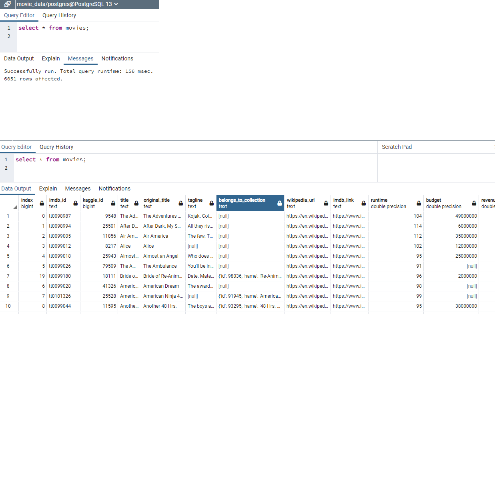
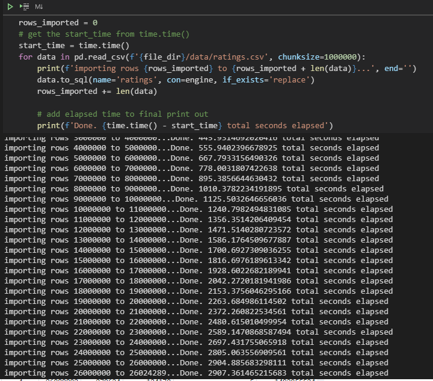

# Movies-ETL

Move data taken from Kaggle, IMDB, and Wikipedia were parssed and cleansed.

The cleansed dataset contains 26,024,289 ratings for 6,052 movies. For each movie, the data contains:
- Kaggle ID
- Title
- Wikipedia URL
- Budget
- Release Date
- Country
- Distributor
- Producer
- Director
- Starring
- Cinematography
- Editors
- Writers
- Composers
- Based on

